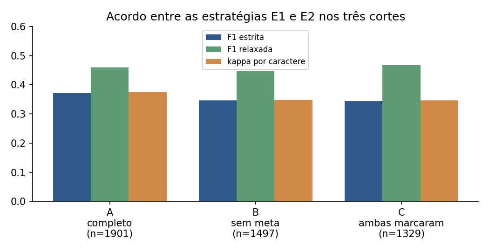
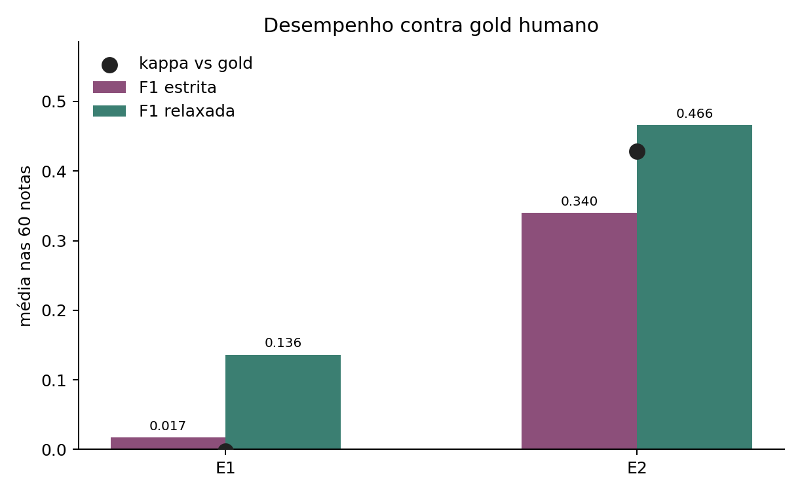
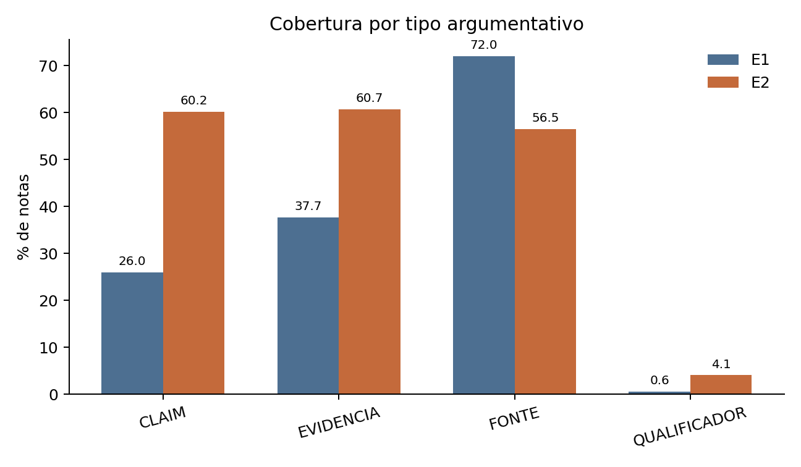
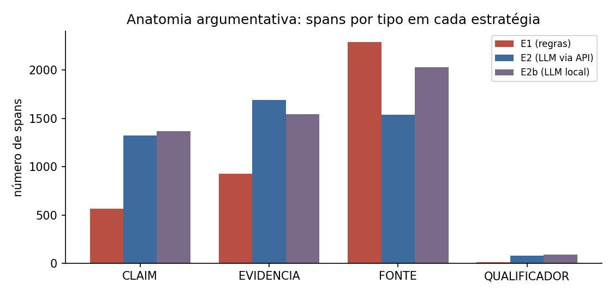
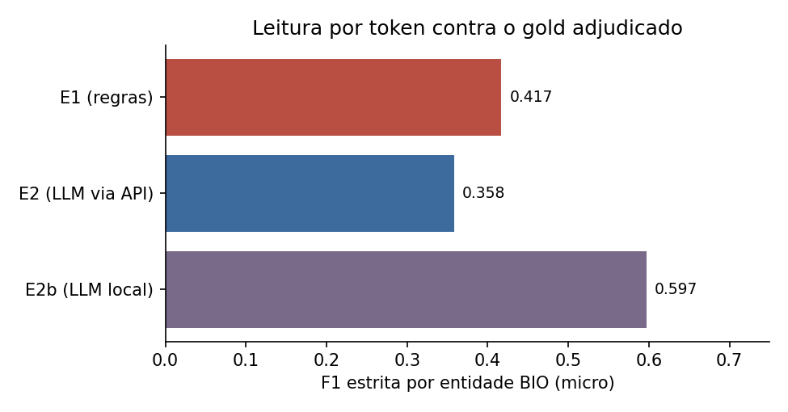
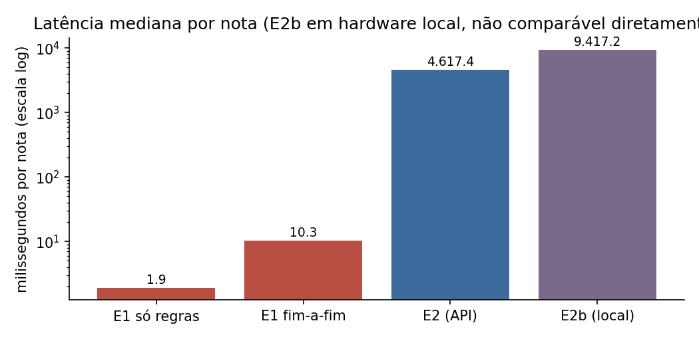
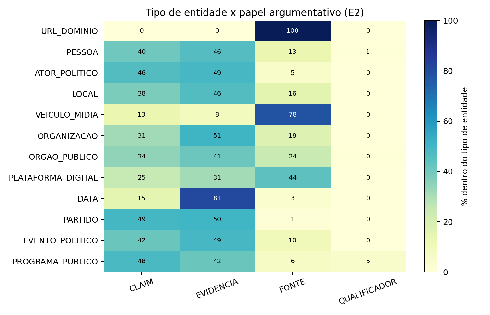

# Relatório final — Mineração de Argumentação em Community Notes BR

**Disciplina:** Processamento de Linguagem Natural — UFSCar, 2026/1
**Docente:** Profa. Dra. Helena Caseli
**Grupo:** Álvaro Barros de Carvalho; Davi Machado da Rocha

## Resumo

As notas da comunidade — *Community Notes*, no X — são textos curtos de checagem colaborativa
atrelados a uma publicação. O sistema decide se uma nota é *útil* e merece ser exibida; não diz
nada sobre como ela argumenta. É esse silêncio que o trabalho ocupa. Tomou-se a estrutura interna
da nota como objeto e formulou-se a tarefa como *Mineração de Argumentação* (AM) em português
brasileiro: localizar e tipar, no texto, os segmentos que enunciam uma *alegação* (CLAIM), trazem
*evidência* (EVIDENCIA), citam uma *fonte* (FONTE) ou *modulam* o que se afirma (QUALIFICADOR).
Compararam-se duas estratégias de extração — E1, simbólica, montada sobre regras léxico-sintáticas
e a análise do spaCy; e E2, baseada no modelo de linguagem `qwen3.6-max-preview`. Sobre um corpus
de 1 901 notas e 689 tweets, as duas foram medidas uma contra a outra, em três cortes, e contra um
*gold* humano de 60 notas. O resultado é assimétrico, e por isso interessante: o modelo de
linguagem aproxima-se do humano onde a regra fracassa — a fronteira do *span*, o papel pouco
lexical —, enquanto a regra retribui onde é barata e literal, a cobertura de FONTE. E há um achado
estrutural por baixo das métricas: o *tipo* da entidade mencionada antecipa o papel que ela
desempenha. URL é fonte. Ator político é alegação.

## 1. Introdução

### 1.1 Contexto e recorte conceitual

O *Community Notes* funciona como uma checagem distribuída: qualquer usuário pode escrever uma
nota que contextualiza, qualifica ou refuta uma publicação, e um conjunto de avaliadores decide se
ela aparece. O estado mais comum de uma nota, no corpus, não é "útil" nem "não útil" — é *precisa
de mais avaliações* (NMR), que responde por quase quatro em cada cinco notas. O sistema, na maior
parte do tempo, não decide: suspende o juízo. Esse dado modal organiza o que se segue, porque
desloca a pergunta. Não se trata de saber se a nota está certa, mas de descrever do que ela é
feita.

Convém, aliás, nomear o objeto com precisão. "Checagem de fatos" é um rótulo cômodo e impreciso;
mais justo seria dizer que se verifica a *verossimilhança de um enunciado*. Verossimilhança não é
verdade. A nota não prova; ela argumenta — alega, evidencia, cita, ressalva. Tomar a estrutura
desse argumento como objeto de PLN é assumir que há regularidade ali, e que essa regularidade pode
ser anotada, extraída e medida. O trabalho não julga o mérito factual ou político das alegações;
fica no plano estrutural. É uma escolha de escopo, e ela exclui de propósito a relação entre os
componentes (qual evidência sustenta qual alegação) e a veracidade em si.

### 1.2 Do Seminário 1 a este relatório

No Seminário 1, apresentou-se a proposta: a tarefa de AM aplicada às notas em português, o corpus
de origem e um primeiro plano de extração por regras. O percurso até aqui guardou o núcleo e moveu
as bordas. Três mudanças merecem registro. Primeiro, a comparação deixou de ser apenas
regra-contra-humano e passou a contrapor *duas* estratégias automáticas — acrescentou-se E2, um
modelo de linguagem, e com ele a pergunta sobre o que cada paradigma enxerga. Segundo, atenderam-se
duas recomendações trazidas pela disciplina: adotou-se o formato *BIO* para as anotações e
incorporou-se uma avaliação semiautomática, em nível de *token* (seqeval), além da comparação com o
humano. Terceiro, agregaram-se camadas interpretativas que não estavam na proposta inicial —
assinatura léxica por Dunning, uma lente que cruza tipo de entidade e papel argumentativo, e a
agência sintática das entidades —, materializadas num explorador interativo. O *gold*, por fim,
permanece provisório: foi anotado por uma única pessoa, e o relatório trata isso como limite
declarado, não como detalhe.

### 1.3 Tarefa, perguntas e objetivo

A tarefa escolhida é a segmentação e tipagem de *spans* argumentativos no texto da nota, nos quatro
rótulos do esquema. O objetivo é comparar E1 e E2 entre si e contra a referência humana, e
caracterizar o que distingue uma extração simbólica de uma neural neste gênero. Quatro perguntas
guiam a análise:

1. Em que medida E1 e E2 concordam na identificação dos *spans*?
2. Qual das duas se aproxima mais da anotação humana, no recorte de 60 notas?
3. Que tipos argumentativos a regra captura melhor, e quais o modelo de linguagem?
4. O tipo da entidade mencionada ajuda a prever o papel argumentativo que ela ocupa?

## 2. Fundamentação e trabalhos relacionados

A Mineração de Argumentação identifica componentes argumentativos e suas relações em texto
(Lawrence e Reed, 2020; Stab e Gurevych, 2017; Eger et al., 2017). Adotou-se aqui a formulação
*baseada em spans* — segmentos contíguos rotulados por tipo —, com conversão posterior para
*rotulagem sequencial BIO* (`B-TIPO`, `I-TIPO`, `O`), o formato usual para avaliação em nível de
*token* e para o treino de modelos de sequência (Lafferty et al., 2001).

O gênero impõe suas condições. A nota é curta, ancorada a um tweet, e cumpre função de checagem ou
contextualização — discurso de usuário, com a informalidade e o ruído que isso acarreta (Habernal e
Gurevych, 2017). Daí a opção por manter a análise no plano estrutural-argumentativo, sem deslizar
para a avaliação do conteúdo.

Duas famílias de método disputam a tarefa. De um lado, regras léxico-sintáticas sobre análise
morfossintática — o spaCy e o quadro de *Universal Dependencies* (Honnibal e Montani, 2017);
transparentes, baratas, mas presas ao padrão que se escreveu. De outro, modelos de linguagem
operando por um protocolo de *snippet*-para-*offset*, na linha do que se propôs para NER via LLM
(Wang et al., 2023); flexíveis à paráfrase, ao custo de latência e de um alinhamento que pode
falhar. Três recursos complementam a leitura, não como métrica de desempenho, mas como instrumento
interpretativo: o *log-likelihood* de Dunning (1993) para a assinatura léxica de cada papel; o
GLiNER para a extração de entidades; e a análise por dependências para a agência sintática.

## 3. Dados e medidas de avaliação

### 3.1 Corpus

| Medida | Valor |
|---|---:|
| Notas no corpus do experimento | 1 901 |
| Tweets únicos | 689 |
| Notas por tweet (média; máx.) | 2,8; 19 |
| Modelo de linguagem avaliado | `qwen3.6-max-preview` |
| Notas no recorte com *gold* humano | 60 |

O corpus deriva do conjunto publicado `histlearn/notas-comunidade-ptbr`. O campo `summary` é o
texto anotável; o tweet associado entra como *contexto* — útil, sobretudo, para ancorar a CLAIM, que
muitas vezes não está na nota, mas naquilo que a nota contesta.

### 3.2 Esquema de rótulos

Quatro tipos organizam a anotação, definidos no `guia_anotacao.md` e resumidos abaixo. A alegação é
aquilo que a nota refuta, qualifica ou contextualiza; a evidência, o que a sustenta; a fonte, a
atribuição que lhe dá respaldo; o qualificador, a marca de modulação ou ressalva.

| Rótulo | Definição operacional |
|---|---|
| CLAIM | A alegação que a nota refuta, qualifica ou contextualiza. |
| EVIDENCIA | Fato, dado, contraexemplo ou justificativa que sustenta a checagem. |
| FONTE | Atribuição: veículo, órgão, especialista, documento ou URL citado como respaldo. |
| QUALIFICADOR | Marcador de modulação, ressalva, incerteza ou escopo. |

Os *spans* são marcados apenas no texto da nota; o tweet permanece como contexto, fora do alvo de
anotação.

### 3.3 Recorte com gold e meta-notas

O *gold* foi construído sobre 60 notas estratificadas pelo status do Community Notes — 20 NMR, 20
CRH e 20 CRNH —, deliberadamente sem meta-notas. A estratificação tem motivo: a distribuição real é
desbalanceada (NMR 78,9 %, CRNH 12,5 %, CRH 7,0 %, Outro 1,6 %), e uma amostra proporcional seria,
na prática, uma amostra de NMR.

Nem toda nota argumenta. Há comentários sobre o próprio sistema, piadas, opiniões e notas curtas
demais para conter estrutura. São 404 (21,3 %) dessas *meta-notas* no corpus, com motivos
predominantes de prefixo *NNN*, "muito curta" e "não necessita nota". Distingui-las importou em dois
momentos: na seleção do recorte humano, que as exclui, e na avaliação, em que um corte específico
(B) as remove para isolar o material efetivamente argumentativo.

### 3.4 Normalização BIO

Os *spans* das três fontes — E1, E2 e humano — foram projetados, de forma determinística, para
rótulos de *token* `B-TIPO` / `I-TIPO` / `O`. A projeção preserva os *offsets* de caractere e a
tokenização da árvore de dependências (campo `sintaxe_json`), de modo que a leitura por *span* e a
leitura por *token* descrevem o mesmo objeto. Foi o que viabilizou a avaliação por seqeval e
atendeu à recomendação de adotar o formato BIO.

### 3.5 Medidas de avaliação

Antes das fórmulas, convém fixar o que se compara. A unidade é o *span*: cada estratégia devolve um
conjunto de segmentos tipados, e medir o acordo é comparar dois conjuntos. Quando há *gold*, um deles
é a referência; quando se confrontam E1 e E2, não existe verdade designada — e, por sorte, a F1 entre
dois conjuntos é simétrica, de modo que a comparação independe de qual lado se chama referência.

A *precisão*, a *revocação* e a *F1* partem de uma contagem. Fixada uma noção de acerto — o que conta
como par casado, definido logo adiante —, somam-se os verdadeiros positivos ($TP$, *spans* do sistema
que casam com a referência), os falsos positivos ($FP$, *spans* do sistema sem par) e os falsos
negativos ($FN$, *spans* da referência não recuperados):

$$
P = \frac{TP}{TP + FP}, \qquad R = \frac{TP}{TP + FN}, \qquad F_1 = \frac{2PR}{P+R} = \frac{2\,TP}{2\,TP + FP + FN}.
$$

A precisão pergunta quanto do que o sistema marcou estava certo; a revocação, quanto do que existia
ele encontrou. A F1 é a média harmônica das duas — e, por ser harmônica, pune quem é bom de um lado só.

Tudo depende, então, de quando dois *spans* casam. Sejam $r=[i_r, j_r)$ de tipo $t_r$ e
$s=[i_s, j_s)$ de tipo $t_s$. Em ambos os regimes exige-se $t_r = t_s$; o que muda é a condição sobre
as fronteiras:

$$
\text{estrito:}\quad i_r = i_s \,\wedge\, j_r = j_s
\qquad\qquad
\text{relaxado:}\quad [i_r, j_r) \cap [i_s, j_s) \neq \varnothing.
$$

O regime estrito só perdoa o acerto exato de início, fim e tipo; o relaxado se contenta com qualquer
sobreposição, desde que o tipo coincida. A diferença entre as duas F1 não é detalhe técnico — é
medida. F1 relaxada alta com F1 estrita baixa significa que o sistema *achou a região certa e errou a
borda*; a distância entre elas aproxima, assim, o erro de fronteira.

A F1 ignora aquilo que ambos deixaram *em branco* — todo o texto que nenhum dos dois marcou. O *kappa*
de Cohen corrige isso e, de quebra, desconta o acaso. Rotula-se cada uma das $N$ posições de caractere
do corpus com um rótulo de $\mathcal{L} = \{\text{CLAIM, EVIDENCIA, FONTE, QUALIFICADOR},\, O\}$ — em
que $O$ é "fora de qualquer span" —, segundo cada estratégia. Com a concordância observada $p_o$
(fração de caracteres com rótulo idêntico) e a concordância esperada ao acaso $p_e$, obtida das
distribuições marginais $p_a(\ell)$ e $p_b(\ell)$ de cada rótulo:

$$
p_o = \frac{1}{N}\sum_{i=1}^{N} \mathbb{1}\!\left[\ell_a(i) = \ell_b(i)\right],
\qquad
p_e = \sum_{\ell \in \mathcal{L}} p_a(\ell)\, p_b(\ell),
\qquad
\kappa = \frac{p_o - p_e}{1 - p_e}.
$$

O valor $1$ é acordo perfeito; $0$, o que se esperaria de duas marcações independentes; negativo,
acordo *pior* que o acaso — foi o que ocorreu com E1 contra o humano. Para leitura qualitativa,
adota-se a escala usual (Landis e Koch, 1977): até $0{,}2$, ligeiro; $0{,}2$–$0{,}4$, razoável;
$0{,}4$–$0{,}6$, moderado; $0{,}6$–$0{,}8$, substancial; acima, quase perfeito. Medir em caractere, e
não em *token*, é deliberado: dispensa um acordo prévio sobre tokenização e capta a sobreposição na
resolução mais fina possível.

Projetados os *spans* para BIO, a leitura por *token* usa o seqeval. Cada *token* recebe `B-TIPO`,
`I-TIPO` ou `O`, e uma *entidade* é uma sequência maximal `B-T I-T …`; um acerto exige, na referência,
uma entidade de mesmo tipo *e mesmas fronteiras de token* — é o casamento estrito transposto para a
grade dos *tokens*. As mesmas $P$, $R$ e $F_1$ se aplicam, agora sobre entidades BIO. Reporta-se a
versão *micro* — que agrega $TP$, $FP$ e $FN$ de todos os tipos antes de calcular as taxas, e portanto
pondera pela frequência — e a F1 *por tipo*, que mostra onde o acordo se concentra (na §5.5, em FONTE).

As quatro medidas leem o mesmo fenômeno em escalas distintas. O par estrito/relaxado isola a
fronteira; o *kappa* desconta o acaso e mede a sobreposição em caractere; o seqeval recoloca tudo na
grade de *tokens*, onde os modelos de sequência de fato operam. Nenhuma basta sozinha — e é da leitura
cruzada delas que sai o argumento do §5.

## 4. Estratégias

### 4.1 Visão geral do pipeline

O fluxo encadeia: corpus → preparação → extração por E1 → extração por E2 → seleção das 60 →
anotação humana → normalização BIO → avaliação (E1×E2 e contra o *gold*) → camadas interpretativas
(Dunning, entidades, agência). A arquitetura completa está na Figura 1.

### 4.2 Estratégia E1 — regras léxico-sintáticas

**Recursos em língua portuguesa.** E1 apoia-se no modelo `pt_core_news_md` do spaCy, treinado para o
português, do qual usa tokenização, lematização, etiquetagem morfossintática (POS) e análise de
dependências.

**Pré-processamento e representação.** Cada nota é tokenizada e analisada sintaticamente; sobre essa
representação aplicam-se heurísticas por tipo — padrões léxico-sintáticos para CLAIM e EVIDENCIA — e
uma *regex* de URL que garante a captura de FONTE. A saída é uma lista de *spans* `{início, fim,
tipo}`, posteriormente projetada para BIO. A estratégia é determinística e transparente: o que ela
acerta, acerta por uma razão escrita; o que erra, erra pela mesma razão.

**O que isso implica.** Uma regra não lê o argumento; lê a marca do argumento. Ela encontra a URL
porque a URL tem forma fixa, e perde a alegação parafraseada porque a paráfrase não tem. Esse viés
não é defeito de implementação — é a natureza do método, e reaparece, adiante, em cada métrica.

### 4.3 Estratégia E2 — modelo de linguagem

**Recursos.** E2 usa o modelo `qwen3.6-max-preview`, multilíngue, acessado por API. O prompt
descreve o esquema de rótulos e pede os *spans* tipados; o modelo devolve, além dos trechos, um
*raciocínio* — uma justificativa em linguagem natural, traduzida para o português nas 60 notas, que
serve à análise qualitativa, jamais como gabarito.

**Pré-processamento e representação.** O modelo retorna *snippets* de texto, não posições. Um
protocolo de *snippet*-para-*offset* os realinha à nota, com vários níveis de tolerância (exato,
normalizado, *regex*); registra-se o nível usado em cada caso. URLs, de novo, são garantidas por
*regex* e mescladas ao resultado, porque um modelo de linguagem é desnecessário — e pouco confiável —
para essa subtarefa puramente formal. A saída segue para a mesma projeção BIO.

**O que isso implica.** O modelo lê o discurso, e não apenas sua superfície lexical. Reconhece a
alegação que não traz palavra-gatilho, a evidência cuja fronteira é semântica e não sintática. Paga
por isso em latência e numa dependência incômoda: o trecho precisa *voltar* ao texto, e nem sempre
volta inteiro.

### 4.4 Anotação humana

As 60 notas foram anotadas segundo o `guia_anotacao.md`. O *gold* é, nesta versão, obra de um único
anotador — e isso tem consequência metodológica direta. Sem um segundo anotador independente, não
há *kappa* inter-anotador nem consenso; o que se chama de "humano", aqui, é uma voz, não um coro. O
relatório assume esse limite e o trata como etapa pendente, não como nota de rodapé.

### 4.5 Dificuldades encontradas

Algumas dificuldades foram de método, outras de engenharia, e vale enumerá-las porque desenham o
contorno do que foi possível.

A primeira é a *fronteira*. Onde começa e onde termina uma evidência é uma decisão fluida, e foi a
maior fonte de desacordo — entre as duas estratégias e contra o humano. A segunda é o *alinhamento*
do E2: nem todo *snippet* devolvido pelo modelo reencontra sua posição exata, e 488 notas não
produziram nenhum *span* alinhável (meta-notas, retornos vazios, recusas). A terceira é
operacional: o provedor do modelo *recusou* 7 notas por filtro de conteúdo — um custo silencioso de
depender de uma API. A quarta foi de representação: as colunas de *span* gravadas como estruturas
aninhadas exigiram leitura com ferramentas que as preservam (DuckDB, `fastparquet`), sob pena de
voltarem vazias. A quinta é o *desbalanceamento*: NMR domina o corpus, e QUALIFICADOR é raro a ponto
de quase desaparecer das métricas — o que limita o que se pode afirmar sobre esse tipo. E a sexta,
já dita, é o *gold* de um anotador só.

## 5. Resultados — avaliação quantitativa

Os números a seguir foram reconciliados de forma reprodutível a partir das células determinísticas
de `notebook_conclusao.ipynb` (script `_reconciliar_relatorio.py`, saídas em `outputs/`).

### 5.1 Acordo E1 × E2 nos três cortes

| Corte | n | F1 estrita | F1 relaxada | κ char-level |
|---|---:|---:|---:|---:|
| A — completo | 1 901 | 0,307 | 0,459 | 0,366 |
| B — sem meta | 1 497 | 0,272 | 0,446 | 0,338 |
| C — ambas marcaram | 1 331 | 0,250 | 0,466 | 0,334 |

O acordo decai de A para C na métrica estrita e no *kappa*. O sentido do movimento importa: quanto
mais o corte se restringe a notas com material argumentativo real, mais as estratégias divergem.
Logo, a discordância não está no ruído — está exatamente onde há argumento para delimitar.

### 5.2 Comparação contra o gold humano

| Estratégia | F1 estrita | F1 relaxada | κ vs gold |
|---|---:|---:|---:|
| E1 | 0,017 | 0,136 | −0,003 |
| E2 | 0,340 | 0,466 | 0,428 |

A distância é grande, e diz onde cada uma fracassa. A F1 estrita de E1 é praticamente nula, e o seu
*kappa* contra o humano beira o zero — as regras acertam o miolo, mas erram a borda, e a métrica
estrita não perdoa a borda. A relaxada melhora porque exige apenas sobreposição. O E2, ao contrário,
acompanha o humano tanto na presença quanto na extensão dos *spans*.

### 5.3 Cobertura por tipo

| Tipo | Cobertura E1 (%) | Cobertura E2 (%) |
|---|---:|---:|
| CLAIM | 26,0 | 60,2 |
| EVIDENCIA | 37,7 | 60,7 |
| FONTE | 72,0 | 56,5 |
| QUALIFICADOR | 0,6 | 4,1 |

Aqui aparece a divisão de trabalho. A regra cobre 72 % das FONTEs — território de URL e veículo,
onde a forma denuncia o papel — e desaba em CLAIM e EVIDENCIA, que dependem de discurso. O modelo é
mais parelho entre os três tipos maiores. QUALIFICADOR é deserto para ambos, e a razão é o corpus:
o tipo é raro demais para sustentar cobertura.

### 5.4 Anatomia argumentativa no corpus

| Estratégia | CLAIM | EVIDENCIA | FONTE | QUALIFICADOR | Spans/nota (com span) |
|---|---:|---:|---:|---:|---:|
| E1 | 563 | 925 | 2 376 | 11 | 2,47 |
| E2 | 1 324 | 1 689 | 1 535 | 78 | 3,27 |

Os volumes confirmam o perfil. O que E1 produz é, antes de tudo, FONTE: 2 376 *spans*, mais do que
todos os seus outros tipos somados. O E2 distribui — evidência, fonte e alegação em proporções
próximas —, e é justamente essa distribuição que o avizinha do humano. A Figura 2 dá a forma do
contraste.

### 5.5 Avaliação token-level (BIO/seqeval)

A leitura por *token* repete, com outra lente, o que as métricas por *span* já indicavam, e
acrescenta detalhe por tipo.

| Comparação | Escopo | P | R | F1 |
|---|---|---:|---:|---:|
| E1 × E2 | micro | 0,181 | 0,253 | 0,211 |
| E1 × E2 | FONTE | 0,522 | 0,404 | 0,456 |
| E1 × E2 | CLAIM | 0,015 | 0,045 | 0,023 |
| E1 × E2 | EVIDENCIA | 0,009 | 0,018 | 0,012 |
| E1 vs humano | micro | 0,011 | 0,020 | 0,014 |
| E2 vs humano | micro | 0,293 | 0,485 | 0,366 |
| E2 vs humano | CLAIM | 0,321 | 0,447 | 0,374 |
| E2 vs humano | EVIDENCIA | 0,375 | 0,491 | 0,425 |
| E2 vs humano | FONTE | 0,132 | 0,714 | 0,222 |
| E2 vs humano | QUALIFICADOR | 0,000 | 0,000 | 0,000 |

Três leituras se impõem. No acordo E1×E2, FONTE é o único tipo com F1 expressiva (0,456) — coerente
com seu caráter lexical. Contra o humano, E1 quase não recupera nada em nível de *token* (0,014), e
o E2 chega a 0,366, com força em CLAIM e EVIDENCIA. E há uma assimetria reveladora no FONTE do E2
contra o humano: revocação altíssima (0,714) e precisão baixa (0,132) — o modelo *vê fonte demais*,
marca como respaldo o que o humano não marcaria. O QUALIFICADOR zera; é o limite que o corpus impõe.

### 5.6 Custo computacional

| Estratégia | Latência mediana | p95 | Observação |
|---|---:|---:|---|
| E1 | 1,9 ms | 8,9 ms | Regras locais; custo desprezível. |
| E2 | 4,6 s | 10,8 s | API remota; máx. 26,7 s. |

A diferença é de três ordens de grandeza por nota. Não é um detalhe de implementação: define quando
cada estratégia é viável. Processar o corpus inteiro por regra é instantâneo; por modelo de
linguagem, é uma operação que se planeja — e que, em 7 notas, simplesmente não aconteceu, barrada
pelo filtro do provedor.

### 5.7 Assinatura léxica por tipo (Dunning)

Contar palavra crua não serve. As mais frequentes em qualquer *span* seriam as mais frequentes da
língua — artigos, preposições, o ruído de fundo do português. A pergunta certa não é *o que é
frequente*, mas *o que é frequente demais, aqui, para ser acaso*. É o que mede o *log-likelihood* de
Dunning (1993).

Para um lema $w$ e um tipo-alvo — digamos, FONTE —, monta-se uma tabela de contingência: $a$ é a
frequência de $w$ dentro dos *spans* desse tipo, $b$ a frequência de $w$ no restante do corpus, e $c$
e $d$ os totais de lemas de cada lado. Sob a hipótese nula — $w$ é igualmente provável dentro e fora
do tipo —, as contagens esperadas seriam:

$$
E_a = c\,\frac{a+b}{c+d}, \qquad E_b = d\,\frac{a+b}{c+d}.
$$

O quanto o observado se afasta dessa expectativa é o que a estatística capta:

$$
G^2 = 2\left[\, a\,\ln\frac{a}{E_a} + b\,\ln\frac{b}{E_b} \,\right].
$$

$G^2$ segue, aproximadamente, uma $\chi^2$ com um grau de liberdade; retêm-se apenas os lemas com
$G^2 \geq 3{,}84$ — o limiar de significância a $p < 0{,}05$ — e, dentre eles, só os de
*sobre*-representação, isto é, com $a/c > (a+b)/(c+d)$. O que sobra, sobre a base do E2, é o
vocabulário que *distingue* cada papel:

| Tipo | Lemas mais distintivos |
|---|---|
| CLAIM | falso, news, post, fake, choquei, mente, astrazeneca, diploma, bilhões, custar |
| EVIDENCIA | ano, financeiro, confirmar, registro, código, parlamentar, janeiro, fiscalização, idade, controle |
| FONTE | conforme, fonte, artigo, acordo, site, constituição, sbt, canal, imprensa, inep |
| QUALIFICADOR | enganoso, potencialmente, provavelmente, claramente, apesar, acreditar, especulação, caso, importante, verdadeiro |

A assinatura é semanticamente coerente — e a coerência é, ela própria, um resultado. A alegação
concentra os verbos da refutação (*falso, fake, mente*); a fonte, os marcadores de atribuição
(*conforme, fonte, imprensa*); o qualificador, os advérbios da dúvida (*potencialmente, provavelmente,
apesar*). Que o sinal argumentativo se deixe, em parte, capturar por léxico explica por que a regra
não chega a zero: há, em cada papel, palavras que o denunciam.

### 5.8 Lente entidade × papel

Cruzar as entidades extraídas (GLiNER) com o papel atribuído pelo E2 revela o achado mais
estrutural do trabalho: o *tipo* da entidade prevê o papel. Domínios de URL e veículos de mídia
caem, com forte regularidade, em FONTE; atores políticos e partidos, em CLAIM e EVIDENCIA; órgãos
públicos se espalham. A entidade, quando entra na nota, já entra fantasiada de um papel — e o papel
é função do que ela é. A Figura 7 traz o mapa de calor.

### 5.9 Agência sintática

A análise por dependências separa as entidades que *agem* (sujeito) das que *sofrem a ação*
(objeto ou oblíquo). O padrão varia, e o contraste é eloquente: *Lula* aparece mais como sujeito (45
ocorrências) do que como objeto (17); *Brasil*, ao contrário, mais como objeto (56) do que como
sujeito (18). Não é uma métrica de desempenho — é uma leitura. Diz menos sobre o extrator e mais
sobre como as notas mobilizam suas figuras: umas conduzem a ação, outras a recebem.

## 6. Avaliação qualitativa

As métricas dizem *quanto*; falta dizer *como*. A inspeção das notas, apoiada no raciocínio do E2 e
no explorador interativo, esclarece o que os números resumem.

O caso típico de divergência é a nota de refutação com fonte explícita. Tome-se uma nota que corrige
a atribuição de uma charge: afirma que ela *não* foi publicada por um jornal, aponta seu verdadeiro
autor e remete a links. Diante dela, E1 faz o que sabe — marca as URLs como FONTE — e ignora o
resto. O E2 lê a arquitetura: identifica a alegação contestada, o trecho que a desmente como
EVIDENCIA, a atribuição como FONTE. É o retrato, em uma nota, da Tabela 5.3.

O raciocínio devolvido pelo modelo torna esse comportamento *interpretável* — e essa transparência,
ela mesma, é um resultado. Lê-se por que o E2 decidiu como decidiu, o que é impensável numa regra
(que não decide, executa) e valioso para a anotação humana, que pode usar a justificativa para
desencravar dúvidas. Daí a cautela deliberada: o raciocínio entra como apoio, nunca como gabarito,
sob pena de circularidade.

Os modos de erro também têm rosto. O E2 *vê fonte demais* — a precisão baixa em FONTE contra o
humano (0,132) corresponde a marcar como respaldo menções que o anotador deixaria de fora. E erra
por excesso de zelo discursivo onde o humano foi parcimonioso. O E1 erra ao contrário: por defeito,
recortando só o que tem forma. Já o QUALIFICADOR, que zera nas métricas, é menos um fracasso dos
extratores e mais uma escassez do corpus — não há ressalva suficiente para aprender a reconhecê-la.
Reconhecer essa diferença — entre o que o método não consegue e o que o dado não oferece — é parte
do que a avaliação qualitativa acrescenta.

## 7. Discussão

Lendo o conjunto, o quadro se fecha em poucas teses. O modelo de linguagem aproxima-se do humano
porque a tarefa, no fundo, é discursiva, e o discurso é o que ele modela; a regra fica para trás na
fronteira porque a fronteira é semântica, e a regra só vê forma. Mas a regra não é descartável — ela
retribui em FONTE e em custo, e isso desenha um arranjo *complementar* antes que uma disputa: regra
para o que é literal e barato, modelo para o que é discursivo e caro.

Há um sentido que escapa às métricas e convém nomear. Que as regras produzam, sobretudo, FONTE não é
só um fato de cobertura — é um modo de ver. A regra trata a URL como traço *estrutural* da
argumentação, não como acessório; ela enxerga a citação e não a alegação porque a citação tem
endereço. E o achado de que o tipo da entidade antecipa o papel sugere que, neste gênero, o
argumento é em boa medida *posicional*: a peça já chega com sua função, e descrever a estrutura é,
em parte, descrever quem ocupa qual lugar.

Quanto às camadas interpretativas — Dunning, entidades, agência —, elas não competem com a F1. Fazem
outra coisa: mostram que sob o desacordo das métricas há regularidade, e que essa regularidade é
legível. Uma única F1 jamais revelaria que *Brasil* sofre a ação enquanto *Lula* a conduz.

## 8. Limitações

O *gold* tem um anotador, e por isso o que se mede contra o "humano" é uma posição, não um consenso;
o *kappa* inter-anotador segue pendente. A fronteira do *span* é instável e penaliza com dureza a
métrica estrita — o que recomenda interpretar a relaxada e a estrita em conjunto, e não isoladas.
Avaliou-se um único modelo de linguagem, num único idioma, sobre um corpus de gênero e período
específicos; generalizar exige cautela. O QUALIFICADOR é raro a ponto de tornar frágil qualquer
afirmação sobre ele. Nenhuma dessas limitações invalida o quadro; todas circunscrevem o que ele
pode afirmar.

## 9. Considerações finais

### 9.1 Síntese

O trabalho comparou uma extração simbólica e uma neural de estrutura argumentativa em notas de
comunidade em português, e respondeu às quatro perguntas. E1 e E2 concordam de forma apenas
moderada, e o acordo *diminui* onde há mais argumento (P1). O modelo de linguagem aproxima-se mais do
humano, com folga (P2). A regra vence em FONTE, o modelo nos tipos discursivos (P3). E o tipo da
entidade, de fato, prevê o papel argumentativo (P4). O saldo não é a vitória de um paradigma sobre
o outro, mas a divisão de trabalho entre eles — e um corpus que, examinado de perto, argumenta com
regularidade suficiente para ser descrito.

### 9.2 Aprendizados do grupo

Alguns aprendizados ficam, para além do resultado. Aprendeu-se que, neste gênero, a *fronteira* — e
não a presença — é o problema difícil, e que a escolha entre F1 estrita e relaxada já é uma decisão
teórica sobre o que conta como acerto. Aprendeu-se que comparar regra e modelo de linguagem não é
ranquear, mas mapear vieses complementares: cada paradigma falha de um jeito que diz o que ele é.
Aprendeu-se que o caro num *pipeline* com LLM não é só a inferência — é o *alinhamento* do que ele
devolve, e a fragilidade de depender de uma API que pode recusar. Aprendeu-se a tratar a anotação
como infraestrutura: sem BIO e sem *offsets* preservados, não há avaliação por *token*, e sem um
segundo anotador não há consenso a medir. E aprendeu-se, talvez o mais durável, que uma camada
interpretativa barata — entidades, agência, assinatura léxica — às vezes diz mais sobre o corpus do
que um décimo a mais de F1.

### 9.3 Trabalhos futuros

O passo imediato é fechar a segunda anotação independente, calcular o *kappa* inter-anotador e
recompor o *gold* por consenso, recalculando as métricas contra ele. A seguir, treinar e avaliar
modelos de sequência sobre o BIO já disponível (CRF, BERTimbau), que substituiriam a heurística do
E1 por um aprendizado de fronteira. Vale, ainda, comparar outros modelos de linguagem — inclusive os
específicos para o português — e estender a análise às dimensões temática e longitudinal do corpus,
que este recorte apenas tangenciou.

## Referências

(A normalizar no formato exigido pela disciplina; base inicial na `Proposta PLN.docx`.)

- Agência Lupa. Só 8% das notas da comunidade feitas em português no X chegam aos usuários. 2023.
- Dunning, T. Accurate methods for the statistics of surprise and coincidence. 1993.
- Eger, S.; Daxenberger, J.; Gurevych, I. Neural end-to-end learning for computational argumentation mining. 2017.
- Habernal, I.; Gurevych, I. Argumentation mining in user-generated web discourse. 2017.
- Honnibal, M.; Montani, I. spaCy 2: Natural language understanding. 2017.
- Lafferty, J.; McCallum, A.; Pereira, F. Conditional random fields. 2001.
- Landis, J. R.; Koch, G. G. The measurement of observer agreement for categorical data. 1977.
- Lawrence, J.; Reed, C. Argument mining: a survey. 2020.
- Núcleo Jornalismo. O que o Twitter sob Musk significa para o Sul Global. 2022.
- Qwen Team. Qwen3.6 technical overview. 2025.
- Rocha, D. M. Community Notes BR: an enriched Portuguese subset of X's crowdsourced fact-checking notes. 2026.
- Schneider, E. T. R. et al. Ferramentas e recursos para o processamento sintático. 2026.
- Souza, F.; Nogueira, R.; Lotufo, R. BERTimbau. 2020.
- Stab, C.; Gurevych, I. Parsing argumentation structures in persuasive essays. 2017.
- Wang, S. et al. GPT-NER: Named entity recognition via large language models. 2023.

## Apêndice A — Artefatos e reprodutibilidade

| Artefato | Uso |
|---|---|
| `notebooks/notebook_preparacao_v2.ipynb` | Preparação do corpus e extração E1. |
| `notebooks/notebook_conclusao.ipynb` | Fonte canônica de resultados, BIO e avaliação. |
| `_reconciliar_relatorio.py` · `outputs/` | Reprodução determinística das métricas e exportação dos CSVs. |
| `figuras_relatorio/` | Figuras estáticas incorporadas a este relatório. |
| `data/dataset_anotado_final_com_bio.csv` | Dataset completo (spans, métricas, BIO, sintaxe). |
| `data/gold/` | Anotação humana provisória (JSON e CoNLL/BIO). |
| `data/qualitative_60_reasoning.jsonl` | Raciocínio do E2 nas 60 notas. |
| `explorador/` | Visualização interativa (5 visões) para figuras e inspeção qualitativa. |

## Apêndice B — Figuras

| Figura | Conteúdo |
|---|---|
| Figura 1 | Arquitetura do pipeline. |
| Figura 2 | Anatomia de *spans* E1 × E2. |
| Figura 3 | Acordo E1 × E2 nos três cortes. |
| Figura 4 | Desempenho contra o *gold* humano. |
| Figura 5 | Cobertura por tipo. |
| Figura 6 | Avaliação BIO *token-level*. |
| Figura 7 | Tipo de entidade × papel argumentativo. |

## Apêndice C — Pendências para a versão de entrega

1. Incorporar a segunda anotação independente e recalcular as métricas contra o consenso.
2. Transcrever as definições integrais dos rótulos do `guia_anotacao.md` (§3.2).
3. Normalizar as referências no padrão exigido e definir o formato final (Markdown, DOCX ou LaTeX).
4. Inserir a Figura 1 (arquitetura) e revisar legendas.
