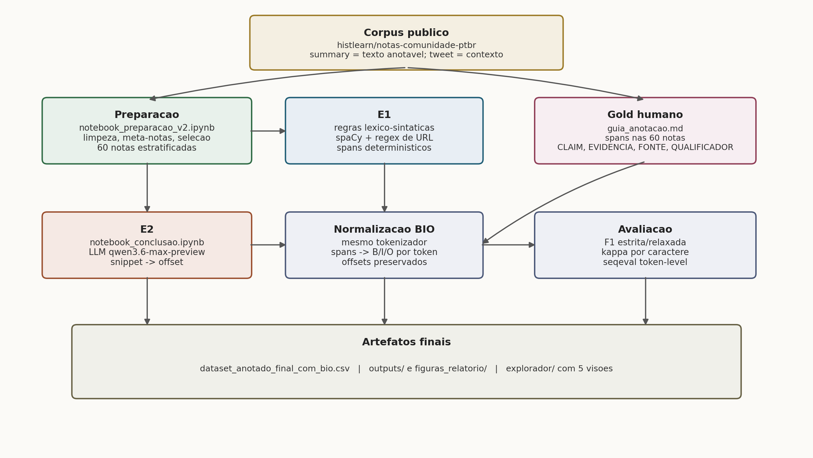
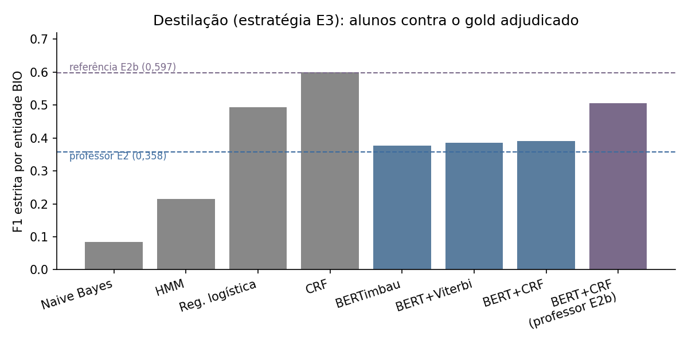

# Relatório final — Mineração de Argumentação em Community Notes BR

**Disciplina:** Processamento de Linguagem Natural — UFSCar, 2026/1
**Docente:** Profa. Dra. Helena Caseli
**Grupo:** Álvaro Barros de Carvalho; Davi Machado da Rocha
**Data:** julho de 2026

## Resumo

As Community Notes do X são textos curtos de checagem colaborativa, escritos por usuários e atrelados a uma publicação. O sistema da plataforma decide se uma nota é útil e merece aparecer, mas não diz nada sobre como ela argumenta. Este trabalho investiga essa lacuna: tratamos a estrutura interna da nota como objeto de Mineração de Argumentação em português brasileiro, localizando e classificando os trechos que fazem uma alegação (CLAIM), apresentam uma evidência (EVIDENCIA), citam uma fonte (FONTE) ou modulam o que se afirma (QUALIFICADOR).

Comparamos três estratégias de extração sobre um corpus de 1.901 notas: uma simbólica, baseada em regras léxico-sintáticas (E1); uma baseada em um modelo de linguagem de grande porte acessado por interface remota (E2); e uma reexecução fiel da segunda com um modelo de pesos abertos rodando localmente (E2b). As três foram medidas entre si e contra um gold humano construído por duas anotações independentes seguidas de adjudicação, sobre um recorte de 60 notas. Uma quarta frente, de destilação (E3), treinou rotuladores de sequência clássicos e neurais usando as marcações do modelo de linguagem como supervisão fraca.

Quatro resultados organizam o trabalho. Primeiro, a concordância entre os dois anotadores humanos sobe de 0,334 para 0,632 (kappa de Cohen em nível de caractere) quando se desconta a camada de fontes ancoradas em URL, que é injetada por expressão regular dos dois lados da régua — separar o que é infraestrutura do que é decisão tornou-se o eixo metodológico do relatório. Segundo, o desempenho contra o gold depende da leitura: na leitura completa o modelo local alcança F1 estrita de 0,501, e na leitura sem fontes de URL o modelo remoto lidera com 0,399 — e depende também de qual anotador define a referência, o que medimos de forma explícita. Terceiro, a correção de um defeito de ingestão de dados elevou a F1 estrita da estratégia de regras de 0,307 para 0,372 no acordo com o modelo de linguagem, sem alterar a F1 relaxada, confirmando que parte do erro de fronteira era artefato e não limite do método. Quarto, a destilação funcionou além do esperado: um campo aleatório condicional clássico atingiu F1 estrita de 0,599 por entidade, no nível da melhor referência baseada em modelo de linguagem, gastando 0,32 milissegundo por nota.

## 1. Introdução

### 1.1 Contexto e recorte conceitual

O Community Notes funciona como uma checagem distribuída: qualquer usuário pode escrever uma nota que contextualiza, qualifica ou refuta uma publicação, e um grupo de avaliadores decide se ela será exibida. No nosso corpus, o estado mais comum de uma nota é "precisa de mais avaliações" (na sigla da plataforma, NMR), que responde por 78,9 por cento das notas; os estados "considerada útil" (CRH) e "considerada não útil" (CRNH) somam menos de um quinto. Na maior parte do tempo, portanto, o sistema não decide — e é esse dado que desloca a pergunta do trabalho: não queremos saber se a nota está certa, e sim descrever do que ela é feita.

Vale nomear o objeto com precisão. "Checagem de fatos" é um rótulo cômodo, mas o que a nota faz é discutir a verossimilhança de um enunciado: ela alega, apresenta evidência, cita uma fonte, faz ressalvas. Tomar essa estrutura como objeto de Processamento de Linguagem Natural pressupõe que existe regularidade ali, e que essa regularidade pode ser anotada, extraída e medida. Ficamos deliberadamente no plano estrutural: não julgamos o mérito factual das alegações, e deixamos de fora a relação entre os componentes (qual evidência sustenta qual alegação).

### 1.2 Do Seminário 1 a este relatório

No Seminário 1 apresentamos o essencial da proposta: a tarefa de Mineração de Argumentação sobre notas em português, o corpus de origem e duas estratégias de extração, uma simbólica e uma baseada em modelo de linguagem. Esse núcleo se manteve. O caminho, porém, cresceu em cinco direções, e cada uma delas está documentada nas seções que seguem.

A primeira direção respondeu a recomendações da disciplina: normalizamos a anotação para o formato BIO em nível de token e acrescentamos uma avaliação semiautomática de sequência ao lado da comparação com o humano. A segunda foi de proveniência: passamos a guardar no dataset a anotação linguística (classe gramatical, lema e relações de dependência) que antes era calculada e descartada, e é dela que vivem as análises interpretativas. A terceira foi a construção completa do gold humano: segunda anotação independente, medição da concordância entre anotadores e adjudicação com trilha auditável de decisões. A quarta foi a inclusão de uma terceira estratégia de extração, que reexecuta o protocolo do modelo de linguagem com um modelo de pesos abertos rodando localmente. A quinta foi transformar em experimento aquilo que a proposta listava como trabalho futuro: a destilação do modelo de linguagem em rotuladores de sequência baratos, apresentada como estratégia E3.

Duas correções de percurso merecem registro desde já, porque afetam números: a ingestão de fontes por entidades pré-extraídas continha um defeito de deslocamento de posições, corrigido e medido na seção 4.2; e descobrimos que a camada de fontes ancoradas em URL se comporta como infraestrutura compartilhada entre sistemas e anotadores, o que motivou o desenho de avaliação em duas leituras, descrito na seção 3.6.

### 1.3 Tarefa, perguntas e objetivo

A tarefa é a segmentação e tipagem de spans argumentativos no texto da nota, nos quatro rótulos do esquema. O objetivo é duplo: comparar as estratégias entre si e contra a referência humana, e caracterizar o que distingue uma extração simbólica de uma neural neste gênero de texto. Cinco perguntas guiam a análise:

1. Em que medida as estratégias automáticas concordam entre si na identificação dos spans?
2. Qual estratégia se aproxima mais da anotação humana — e quanto essa resposta depende de qual humano define a referência?
3. Que tipos argumentativos cada estratégia captura melhor?
4. O tipo da entidade mencionada ajuda a prever o papel argumentativo que ela ocupa?
5. É possível destilar o modelo de linguagem em um rotulador barato que recupere a estrutura argumentativa humana melhor que a heurística de regras?

## 2. Fundamentação e trabalhos relacionados

A Mineração de Argumentação identifica componentes argumentativos e suas relações em um texto (Lawrence e Reed, 2020; Stab e Gurevych, 2017; Eger et al., 2017). Adotamos a formulação baseada em spans — segmentos contíguos rotulados por tipo — com conversão posterior para rotulagem sequencial BIO, o formato usual para avaliar em nível de token e para treinar modelos de sequência (Lafferty et al., 2001).

O gênero impõe condições próprias. A nota é curta, presa a uma publicação, e cumpre função de checagem ou contextualização; é discurso de usuário, com a informalidade e o ruído que isso traz (Habernal e Gurevych, 2017). Por isso mantivemos a análise no plano estrutural, sem deslizar para a avaliação do conteúdo.

Três famílias de método sustentam o experimento. As regras léxico-sintáticas apoiam-se em análise morfossintática — usamos o spaCy e o quadro de Dependências Universais (Honnibal e Montani, 2017; Schneider et al., 2026) — e são transparentes e baratas, mas limitadas ao padrão que se escreveu. Os modelos de linguagem operam por um protocolo que pede trechos literais e os realinha ao texto, na linha do que se propôs para reconhecimento de entidades (Wang et al., 2023); são flexíveis diante da paráfrase, ao custo de latência e de um alinhamento que pode falhar. A destilação de conhecimento (Hinton et al., 2015) fecha o arco: usa as saídas de um modelo caro como supervisão fraca para treinar modelos baratos, dos generativos clássicos ao BERTimbau (Souza et al., 2020). Três recursos complementam a leitura como instrumentos de interpretação, não de desempenho: a razão de verossimilhança de Dunning (1993) para a assinatura léxica de cada papel, as entidades nomeadas do corpus para a lente entidade e papel, e a análise de dependências para a agência sintática.

## 3. Dados e medidas de avaliação

### 3.1 Corpus

| Medida | Valor |
|---|---:|
| Notas no corpus do experimento | 1.901 |
| Publicações (tweets) únicas | 689 |
| Notas por publicação (média; máximo) | 2,8; 19 |
| Notas no recorte com gold humano | 60 |

O corpus deriva do conjunto público `histlearn/notas-comunidade-ptbr`. O campo `summary` é o texto que anotamos; a publicação associada entra como contexto, útil sobretudo para ancorar a alegação, que muitas vezes não está na nota, mas naquilo que a nota contesta. O conjunto de origem evoluiu durante o projeto (a tabela de entidades foi pós-processada e ganhou camadas de auditoria de qualidade e de sintaxe automática); por isso os notebooks fixam a revisão exata usada nos downloads, e a seção 4.2 explica como a auditoria pública do próprio conjunto confirmou um defeito que havíamos encontrado de forma independente. A camada sintática nativa do conjunto foi gerada sobre uma versão do texto sem URLs; como as URLs são centrais para o papel de fonte, mantivemos nossa própria camada sintática, gerada com o spaCy sobre o texto integral.

### 3.2 Esquema de rótulos

Quatro tipos organizam a anotação. As definições seguem o guia de anotação do projeto; no guia o rótulo aparece como EVIDÊNCIA, e nos artefatos a forma técnica é EVIDENCIA, sem acento.

**CLAIM — a alegação refutada.** É o trecho da nota que expressa a afirmação que a publicação fazia e que a nota corrige ou qualifica. Pode aparecer como negação direta, paráfrase ou citação. Pistas frequentes em português: "não é verdade que", "é falso que", "a foto não mostra", "não há evidência de que". Exemplo positivo:

```text
NOTA: "A foto não mostra um protesto em Brasília em 2024."
                          [CLAIM]
```

Exemplo negativo:

```text
NOTA: "Segundo a AFP, a imagem é de 2013."
       [FONTE]        [EVIDENCIA]
```

Neste segundo caso não há alegação no texto: ela está implícita na publicação, e a nota apresenta apenas a refutação.

**EVIDENCIA — o fato que sustenta a checagem.** É o conteúdo factual, descritivo ou numérico que a nota oferece para contrariar ou qualificar a publicação. Pistas: verbos como mostrar, indicar, comprovar, confirmar; valores numéricos, datas e percentuais; contraexemplos como "na verdade" e "ao contrário".

**FONTE — atribuição.** É quem ou o que a nota cita como autoridade ou base da informação: veículo de mídia, especialista, órgão público, documento ou endereço eletrônico. Pistas: "segundo", "de acordo com", "conforme"; construções como "afirma", "publicou", "apurou"; URLs completas; nomes de veículos e instituições. Uma observação operacional importante: as URLs eram pré-marcadas como fonte pelo aplicativo de anotação, e essa pré-marcação tem consequências metodológicas discutidas na seção 3.6.

**QUALIFICADOR — modulação ou ressalva.** São advérbios e locuções que modulam o grau de certeza ou o escopo de uma alegação: "aparentemente", "provavelmente", "supostamente", "parcialmente", "fora de contexto". Não marcamos adjetivos descritivos sem função modal nem conectivos puramente discursivos.

Os spans são marcados apenas no texto da nota; a publicação permanece como contexto, fora do alvo de anotação.

### 3.3 Recorte com gold e meta-notas

O gold foi construído sobre 60 notas estratificadas pelo estado da nota na plataforma: vinte de cada um dos três estados principais. A estratificação tem uma razão simples: a distribuição real é desbalanceada, e uma amostra proporcional seria, na prática, uma amostra de um único estado.

Nem toda nota argumenta. Há comentários sobre o próprio sistema, piadas, opiniões e textos curtos demais para ter estrutura. São 404 dessas meta-notas no corpus, ou 21,3 por cento. Distingui-las importou em dois momentos: na seleção do recorte humano, que as exclui, e na avaliação, em que um corte específico as remove para isolar o material que de fato argumenta.

### 3.4 Normalização BIO

As estratégias e os anotadores produzem spans: intervalos contínuos no texto, definidos por início, fim e tipo, em posições de caractere. A avaliação de sequência espera outra forma de dado: uma sequência de rótulos, um para cada token. A normalização BIO é a ponte entre as duas representações — ela não muda a anotação, apenas projeta a mesma marcação para a grade dos tokens.

Para que a comparação fosse justa, projetamos todas as fontes de anotação sobre a mesma tokenização, fixada e versionada. Se cada fonte fosse tokenizada de um jeito, as sequências poderiam ter tamanhos diferentes e a comparação token a token deixaria de fazer sentido. Tokenizamos cada nota uma única vez, registramos o texto e as posições de cada token, e só então comparamos os spans a esses intervalos. A regra básica: um token que não toca nenhum span recebe O; um token coberto por um span recebe B mais o tipo se é o primeiro do trecho, e I mais o tipo nos seguintes. Para os raros casos de fronteira ambígua existe uma política fixa e versionada: vence o span de maior sobreposição com o token; havendo empate, o mais longo; persistindo, uma prioridade fixa de tipo.

Toda projeção quantiza: uma fronteira que cai dentro de um token é arredondada para a borda do token. Medimos essa perda reconstruindo os spans a partir do BIO e comparando com os originais. Para a anotação humana, apenas 2 de 224 spans mudam (0,89 por cento, ambos na barra final de uma URL); para os modelos de linguagem, a perda fica entre 1,3 e 1,4 por cento. Para a estratégia de regras, porém, 16,05 por cento dos spans mudam de fronteira na projeção — as expressões regulares cortam trechos no meio de palavras, um achado que antecipa a discussão sobre fronteiras da seção 8. A perda baixa nas demais fontes valida usar a camada BIO como representação de avaliação.

### 3.5 Medidas de avaliação

O que cada estratégia entrega é uma lista de spans tipados, e avaliar é conferir se essa lista bate com a de uma referência. No recorte com gold, a referência é a anotação humana; na comparação entre estratégias, é a saída da outra estratégia — e nesse caso o número mede acordo, não acerto. Nenhuma medida sozinha conta a história inteira, e por isso usamos quatro, cada uma respondendo a uma pergunta distinta.

A primeira pergunta é de correspondência item a item: dos spans que o sistema marcou, quantos têm par na referência? E dos spans da referência, quantos ele recuperou? É o que precisão, revocação e F1 resumem. Em uma nota, um verdadeiro positivo é um span do sistema que encontra par; um falso positivo é um span marcado sem que houvesse par; um falso negativo é um span da referência que ficou sem correspondência:

$$
P = \frac{TP}{TP + FP}, \qquad R = \frac{TP}{TP + FN}, \qquad F_1 = \frac{2PR}{P+R}.
$$

Tudo depende de definir o que conta como "ter par", e adotamos duas leituras. Na F1 estrita, o par exige tipo, início e fim idênticos. Na F1 relaxada, o tipo precisa coincidir e basta que os trechos se sobreponham de forma substantiva. A distância entre as duas é, na prática, o tamanho do erro de fronteira: quando a relaxada sobe e a estrita não acompanha, o sistema encontrou a região certa e errou o limite fino.

A segunda pergunta olha o texto inteiro, incluindo o que ambas as partes deixaram fora de span. Para isso usamos o kappa de Cohen em nível de caractere: cada caractere recebe um rótulo (um dos quatro tipos ou O), e medimos quanto as duas rotulações concordam, descontando a concordância esperada pelo acaso:

$$
\kappa = \frac{p_o - p_e}{1 - p_e}.
$$

O kappa vale um no acordo perfeito e zero quando o acordo não supera o acaso. Reportamos o kappa em duas agregações — a média dos valores por nota e o valor agregado sobre todos os caracteres do recorte —, porque notas curtas pesam mais na primeira e menos na segunda, e a diferença entre as duas é informativa.

A terceira pergunta vem da recomendação da disciplina de representar a tarefa em BIO: tratando tudo como rotulagem de sequência, um acerto exige o mesmo tipo e as mesmas fronteiras de token. Essa avaliação usa a implementação do projeto verificada, célula a célula, contra a biblioteca seqeval no modo estrito: as duas produzem valores idênticos nos quatro comparativos usados.

A quarta medida é operacional: latência por nota, medida de ponta a ponta para cada estratégia.

### 3.6 A infraestrutura compartilhada de FONTE-URL e as duas leituras

Durante a análise do gold descobrimos um fato que reorganizou a avaliação. Das 123 fontes do gold adjudicado, 113 são endereços eletrônicos — e esses spans não resultam de decisão de ninguém. Do lado dos sistemas, a mesma expressão regular que detecta URLs injeta essas fontes nas três estratégias automáticas; do lado humano, o aplicativo de anotação as pré-marcava na tela. Quando a avaliação casa um span de URL do sistema com um span de URL do gold, ela está medindo uma expressão regular contra ela mesma.

O episódio ficou visível por um acidente instrutivo: os arquivos exportados pelos dois anotadores trataram a pré-marcação de formas opostas — um preservou as 113 fontes de URL, o outro nenhuma. A concordância entre anotadores calculada sobre os arquivos brutos saía artificialmente baixa por causa dessa diferença de ferramenta, não de julgamento.

A resposta metodológica foi decompor em vez de amputar. Não removemos o tipo fonte da avaliação, porque as fontes textuais ("segundo a Folha", "conforme o TSE") são decisões genuínas; e não removemos a injeção de URLs dos sistemas, porque ela é engenharia legítima e documentada. Em vez disso, toda avaliação contra o gold é reportada em duas leituras: a leitura completa, que compara sistemas como eles são, com a infraestrutura incluída; e a leitura sem FONTE-URL, que remove os spans de fonte ancorados em URL dos dois lados da régua e compara apenas o conteúdo decidido. As duas leituras respondem perguntas diferentes e, como as seções de resultados mostram, chegam a inverter rankings.

## 4. Estratégias e anotação humana

### 4.1 Visão geral do pipeline

O fluxo encadeia três notebooks. O primeiro prepara o corpus e executa as extrações automáticas. O segundo constrói o gold humano, faz a normalização BIO e calcula todas as medidas de avaliação — é a fonte canônica dos números deste relatório. O terceiro realiza o experimento de destilação. Os artefatos intermediários (dataset, anotações, gold adjudicado, saídas do modelo local) são arquivos versionados no repositório do projeto, e os notebooks os leem diretamente de lá, o que torna cada número reproduzível a partir do estado público do repositório. A arquitetura completa está na Figura 1.



*Figura 1 — Arquitetura do pipeline experimental, do corpus aos artefatos finais.*

### 4.2 Estratégia E1 — regras léxico-sintáticas

A estratégia E1 se apoia no modelo `pt_core_news_md` do spaCy, treinado para o português, do qual usa tokenização, lematização, etiquetagem morfossintática e análise de dependências. Sobre essa representação aplicamos heurísticas por tipo — padrões léxico-sintáticos para alegação e evidência — e duas vias para fonte: uma expressão regular de URL e as entidades pré-extraídas do conjunto de origem (veículos de mídia, órgãos públicos, fontes citadas). A saída é uma lista de spans que segue para a mesma projeção BIO das demais estratégias. A estratégia é determinística e transparente: quando acerta ou erra, a razão está escrita no código.

Uma correção importante aconteceu nesta rota, e vale narrá-la porque ela mudou números e rendeu um método. A versão original usava diretamente as posições de início e fim registradas na tabela de entidades do conjunto de origem. Descobrimos que essas posições frequentemente não se referem ao texto que anotamos: nas 1.901 notas, apenas 9,2 por cento das entidades candidatas a fonte tinham posições que reproduziam exatamente a superfície esperada, e 90,8 por cento precisaram ser relocalizadas procurando o texto da entidade dentro da nota. A auditoria de qualidade publicada depois pelo próprio conjunto de origem confirmou o diagnóstico de forma independente, marcando cerca de metade das posições como fora do texto de referência. O efeito da correção foi medido preservando tudo o mais: no acordo entre E1 e E2 sobre o corpus inteiro, a F1 estrita subiu de 0,307 para 0,372, enquanto a F1 relaxada ficou praticamente parada (de 0,459 para 0,460). A leitura é direta: a estratégia sempre encontrou as regiões certas, e uma parte substancial do que parecia erro de fronteira era defeito de ingestão de dados.

A latência também foi medida com mais honestidade nesta versão: a aplicação das regras custa 1,9 milissegundo por nota, e a análise sintática que a antecede custa outros 8 milissegundos, somando cerca de 10 milissegundos de ponta a ponta — o número que usamos nas comparações de custo (o processamento em lote amortiza parte da análise sintática).

### 4.3 Estratégia E2 — modelo de linguagem por interface remota

A estratégia E2 usa o modelo `qwen3.6-max-preview` (Qwen Team, 2025), proprietário, acessado por interface de programação remota. A instrução descreve o esquema de rótulos com exemplos e pede trechos copiados literalmente do texto, nunca posições; um protocolo de alinhamento em quatro níveis de tolerância (exato, normalização de espaços, normalização de caracteres, busca aproximada) devolve cada trecho à sua posição no texto, registrando o nível usado. As URLs são garantidas pela mesma expressão regular das demais estratégias, porque um modelo de linguagem é desnecessário para uma subtarefa puramente formal. Além dos trechos, o modelo devolve uma justificativa em linguagem natural, que usamos apenas na análise qualitativa.

Dois custos operacionais desta rota aparecem nos resultados: a latência, em segundos por nota, e as recusas do provedor — sete notas foram bloqueadas por filtro de conteúdo da plataforma remota, um risco típico de depender de um serviço externo.

### 4.4 Estratégia E2b — o mesmo protocolo com um modelo aberto local

A estratégia E2b reexecuta a E2 trocando apenas o motor: em vez do modelo proprietário remoto, um modelo de pesos abertos da mesma família (`Qwen3.6-35B-A3B`, licença Apache 2.0), servido localmente. A instrução, os exemplos, o protocolo de alinhamento e a regra de URL são os mesmos — o desenho isola deliberadamente a variável "modelo", e a assimetria de porte é o ponto, não um vício: a pergunta é quanto da qualidade se preserva ao trocar um serviço proprietário por um modelo que qualquer pessoa pode baixar e executar.

Três diferenças operacionais já apareceram na execução: nenhuma recusa de conteúdo nas 1.901 notas; alinhamento dos trechos ao texto ligeiramente melhor que o do modelo remoto (96,9 por cento de casamentos exatos); e reprodutibilidade plena, porque os pesos são públicos e a execução é local — os resultados da E2, em contraste, dependem de um serviço que pode mudar ou ser descontinuado.

### 4.5 Anotação humana: duas anotações independentes

As 60 notas do recorte foram anotadas de forma independente por dois anotadores, seguindo o guia de anotação do projeto. A primeira anotação produziu 101 spans; a segunda, 217. A independência é verificável nos próprios arquivos: apenas 31 spans são idênticos entre as duas, e os perfis são visivelmente distintos — o segundo anotador marca muito mais fontes, o primeiro distribui mais entre alegação e evidência. Parte dessa diferença, como a seção 3.6 explica, veio da ferramenta e não do julgamento: um arquivo preservou as fontes de URL pré-marcadas e o outro não. A concordância entre os dois, medida nas duas leituras, está na seção 5.2 — e é ela que dimensiona a dificuldade real da tarefa.

### 4.6 Adjudicação e o gold final

Para transformar duas anotações em uma referência única, construímos uma interface de adjudicação dedicada, versionada no repositório. Ela apresenta as duas anotações lado a lado sobre o texto, agrupa as divergências em torno dos trechos disputados, pré-aceita os acordos exatos e registra cada decisão com origem, autor, rodada e horário. O protocolo prevê rodadas nomeadas (parecer individual, revisão cruzada e fechamento) para o caso assíncrono; as camadas com as saídas das estratégias automáticas ficam bloqueadas até a nota ser revisada, para que o gold não seja contaminado pelo sistema que ele avalia, e qualquer consulta posterior fica registrada na trilha.

O gold adjudicado tem 224 spans nas 60 notas (31 alegações, 68 evidências, 123 fontes e 2 qualificadores; 12 notas ficaram deliberadamente sem spans). A trilha de decisões mostra o adjudicador preferindo a leitura do outro anotador na maior parte dos casos — descontada a camada mecânica de URLs, as origens ficam equilibradas entre os dois anotadores e os acordos exatos. No momento da escrita, o gold reflete a rodada de parecer individual; a revisão cruzada pelo segundo anotador está prevista, e todos os artefatos derivados se atualizam por scripts versionados quando ela se concluir.

### 4.7 Dificuldades encontradas

Seis dificuldades desenharam o contorno do que foi possível fazer. A primeira é a fronteira dos spans: onde começa e termina uma evidência é uma decisão fluida, e foi a maior origem de desacordo tanto entre estratégias quanto entre humanos. A segunda é o alinhamento dos trechos devolvidos pelos modelos de linguagem, que nem sempre reencontram sua posição exata no texto. A terceira é operacional: o provedor remoto recusou sete notas por filtro de conteúdo, um custo silencioso que a execução local eliminou. A quarta foi de representação: as colunas de spans, gravadas como estruturas aninhadas, exigem leitores que as preservem (DuckDB ou pyarrow), sob pena de voltarem vazias sem aviso. A quinta é o desbalanceamento: o qualificador é raro a ponto de limitar qualquer afirmação sobre ele. A sexta foi a descoberta de que dados herdados também erram: as posições da tabela de entidades e a pré-marcação de URLs do aplicativo de anotação exigiram, respectivamente, correção medida e desenho de avaliação em duas leituras.

## 5. Resultados — avaliação quantitativa

Os números desta seção saem do notebook de avaliação, executado de ponta a ponta sobre os artefatos versionados; as tabelas exportadas acompanham o repositório.

### 5.1 Acordo entre as estratégias E1 e E2 nos três cortes

| Corte | Notas | F1 estrita | F1 relaxada | Kappa por caractere |
|---|---:|---:|---:|---:|
| A — corpus completo | 1.901 | 0,372 | 0,460 | 0,375 |
| B — sem meta-notas | 1.497 | 0,346 | 0,446 | 0,348 |
| C — ambas produziram spans | 1.329 | 0,344 | 0,468 | 0,347 |

O acordo cai do corte completo para o corte em que ambas as estratégias de fato marcaram algo: quanto mais o recorte se concentra em notas com material argumentativo real, mais as duas divergem — a discordância está na delimitação do argumento, não no ruído. Estes números já refletem a correção da estratégia de regras descrita na seção 4.2.


*Figura 2 — Acordo entre as estratégias E1 e E2 nos cortes A, B e C.*

### 5.2 Acordo entre os anotadores humanos

| Leitura | Kappa (média por nota) | Kappa (agregado) |
|---|---:|---:|
| Completa (com as fontes de URL) | 0,334 | 0,242 |
| Sem FONTE-URL (conteúdo decidido) | 0,632 | 0,650 |

Este é um dos resultados centrais do trabalho. Sobre os arquivos brutos, a concordância entre os dois anotadores parece apenas regular; removida a camada de URLs — que os dois arquivos trataram de formas opostas por diferença de ferramenta —, a concordância sobe para um patamar substancial na escala usual de interpretação (Landis e Koch, 1977). A tarefa é difícil nas fronteiras, mas os humanos concordam bem sobre o que é argumento e onde ele está; boa parte do desacordo aparente era artefato de protocolo. Esse resultado também calibra as expectativas sobre as máquinas: nenhuma estratégia automática deveria ser cobrada por superar a concordância que os próprios humanos alcançam entre si.

### 5.3 Desempenho contra o gold adjudicado, em duas leituras

| Estratégia | Leitura | F1 estrita | F1 relaxada | Kappa (média por nota) |
|---|---|---:|---:|---:|
| E1 (regras) | completa | 0,364 | 0,499 | 0,438 |
| E1 (regras) | sem FONTE-URL | 0,128 | 0,316 | 0,317 |
| E2 (modelo remoto) | completa | 0,364 | 0,456 | 0,365 |
| E2 (modelo remoto) | sem FONTE-URL | 0,399 | 0,515 | 0,540 |
| E2b (modelo local) | completa | 0,501 | 0,626 | 0,593 |
| E2b (modelo local) | sem FONTE-URL | 0,329 | 0,481 | 0,541 |

As duas leituras contam histórias complementares, e é a comparação entre elas que informa. Na leitura completa, vencem as estratégias que reproduzem bem a infraestrutura de URLs presente também no gold: o modelo local lidera com folga e as regras empatam com o modelo remoto. Na leitura sem FONTE-URL — a que compara modelos sobre o conteúdo decidido —, o quadro inverte: o modelo remoto assume a frente, o modelo local recua e as regras caem para um décimo e pouco de F1 estrita, confirmando que sua força está no que é literal. O modelo remoto é o único que melhora quando as URLs saem da conta, porque suas fontes de URL frequentemente erram a fronteira por um caractere. Em notas onde o gold não marca nada, a convenção adotada premia a abstenção; a métrica calculada apenas sobre as notas com gold não vazio acompanha o mesmo ordenamento e está nas tabelas exportadas.


*Figura 3 — F1 estrita contra o gold adjudicado, nas duas leituras.*

### 5.4 Sensibilidade à régua humana

| Estratégia | Gold do anotador 1 | Gold do anotador 2 | Gold adjudicado |
|---|---:|---:|---:|
| E1 (regras) | 0,033 | 0,395 | 0,364 |
| E2 (modelo remoto) | 0,340 | 0,267 | 0,364 |
| E2b (modelo local) | 0,231 | 0,485 | 0,501 |

A tabela reporta a F1 estrita na leitura completa contra três referências: cada anotador isoladamente e o consenso. O ranking muda com a régua: contra o primeiro anotador, o modelo remoto lidera; contra o segundo e contra o consenso, o modelo local. Na leitura sem FONTE-URL o padrão se repete com valores menores e o modelo remoto à frente em todas as réguas (0,420, 0,251 e 0,399, respectivamente). A conclusão não é que uma régua esteja errada, e sim que estilos de anotação legítimos produzem referências diferentes — e que qualquer comparação entre sistemas que reporte um único gold, sem análise de sensibilidade, está escondendo essa variação.

### 5.5 Cobertura por tipo

| Tipo | E1 (regras) | E2 (modelo remoto) | E2b (modelo local) |
|---|---:|---:|---:|
| CLAIM | 26,0 % | 60,2 % | 61,3 % |
| EVIDENCIA | 37,7 % | 60,7 % | 57,3 % |
| FONTE | 71,8 % | 56,5 % | 69,4 % |
| QUALIFICADOR | 0,6 % | 4,1 % | 4,4 % |

A divisão de trabalho aparece com clareza. As regras cobrem quase três quartos das notas com fonte — o território da URL e do veículo de imprensa, onde a forma do texto entrega o papel — e afundam nos tipos que dependem de discurso. Os dois modelos de linguagem são mais equilibrados; o local marca mais fontes que o remoto, um traço de estilo que reaparece em toda a avaliação. O qualificador é raro demais no corpus para sustentar cobertura em qualquer estratégia.


*Figura 4 — Cobertura por tipo argumentativo no corpus completo, pelas três estratégias.*

### 5.6 Anatomia argumentativa no corpus

| Estratégia | CLAIM | EVIDENCIA | FONTE | QUALIFICADOR | Total | Spans por nota |
|---|---:|---:|---:|---:|---:|---:|
| E1 (regras) | 563 | 925 | 2.290 | 11 | 3.789 | 2,42 |
| E2 (modelo remoto) | 1.324 | 1.689 | 1.535 | 78 | 4.626 | 3,27 |
| E2b (modelo local) | 1.366 | 1.546 | 2.032 | 92 | 5.036 | 3,44 |

Os volumes confirmam os perfis: a produção das regras é dominada por fontes; o modelo remoto distribui entre os três tipos maiores; o modelo local combina a distribuição do remoto com um apetite por fontes próximo ao das regras — e é exatamente essa combinação que o favorece contra o gold adjudicado, rico em fontes.


*Figura 5 — Distribuição dos spans por tipo em cada estratégia.*

### 5.7 Leitura por token (BIO)

Na avaliação de sequência sobre o recorte com gold — acerto exige tipo e fronteiras de token idênticos —, a estratégia de regras alcança F1 de 0,417, o modelo remoto 0,358 e o modelo local 0,597. Os valores são coerentes com a leitura completa por span (esta avaliação também inclui a camada de URLs), com uma inversão informativa: em nível de token as regras superam o modelo remoto, porque a projeção BIO arredonda para a borda do token justamente os erros de um caractere que penalizavam as fontes de URL na leitura por caractere. A implementação foi verificada contra a biblioteca seqeval, com valores idênticos.


*Figura 6 — F1 estrita por entidade BIO contra o gold adjudicado.*

### 5.8 Custo computacional

| Estratégia | Latência mediana por nota | Observação |
|---|---:|---|
| E1, só as regras | 1,9 ms | sem contar a análise sintática |
| E1, de ponta a ponta | 10,3 ms | análise sintática mais regras |
| E2 (modelo remoto) | 4,6 s | serviço externo; 7 notas recusadas |
| E2b (modelo local) | 9,4 s | hardware doméstico do grupo |

Na medição honesta, de ponta a ponta, as regras custam cerca de 450 vezes menos que o modelo remoto — duas a três ordens de grandeza, e não as três completas que a medição anterior (sem a análise sintática) sugeria. A latência do modelo local não é diretamente comparável à do remoto, porque depende do hardware onde roda; o que ela compra não é velocidade, e sim soberania: nenhuma recusa, nenhuma dependência de serviço, reprodutibilidade completa.


*Figura 7 — Latência mediana por nota, em escala logarítmica.*

### 5.9 Assinatura léxica por tipo

Contar palavras cruas não ajuda: as mais frequentes em qualquer tipo de span seriam as mais frequentes da língua. A pergunta útil é o que aparece muito mais dentro de um tipo do que se esperaria pelo acaso, e é isso que a razão de verossimilhança de Dunning mede. Para um lema e um tipo-alvo, comparam-se as ocorrências do lema dentro e fora dos spans daquele tipo com o que uma distribuição neutra preveria:

$$
E_a = c\,\frac{a+b}{c+d}, \qquad E_b = d\,\frac{a+b}{c+d}, \qquad G^2 = 2\left[\, a\,\ln\frac{a}{E_a} + b\,\ln\frac{b}{E_b} \,\right].
$$

Mantivemos os lemas com estatística acima do limiar usual de significância e sobre-representados no tipo. O vocabulário que distingue cada papel, calculado sobre a saída do modelo remoto:

| Tipo | Lemas mais distintivos |
|---|---|
| CLAIM | falso, news, post, fake, choquei, mente, astrazeneca, diploma, bilhões, custar |
| EVIDENCIA | ano, financeiro, confirmar, registro, código, parlamentar, janeiro, fiscalização, idade, controle |
| FONTE | conforme, fonte, artigo, acordo, site, constituição, sbt, canal, imprensa, inep |
| QUALIFICADOR | enganoso, potencialmente, provavelmente, claramente, apesar, acreditar, especulação, caso, importante, verdadeiro |

A coerência semântica dessa assinatura é um resultado em si: a alegação concentra o vocabulário da refutação, a fonte concentra os marcadores de atribuição, o qualificador concentra os advérbios de dúvida. Que o sinal argumentativo se deixe capturar em parte pelo léxico explica por que a estratégia simbólica não fica em zero: em cada papel existem palavras que o denunciam.

### 5.10 Tipo de entidade e papel argumentativo

Cruzar as entidades nomeadas do corpus com o papel atribuído pelo modelo remoto revela um achado estrutural: o tipo da entidade antecipa o papel. Domínios de internet e veículos de mídia caem com forte regularidade em fonte; atores políticos e partidos, em alegação e evidência; órgãos públicos se espalham. Quando uma entidade entra na nota, ela já entra com um papel provável, e esse papel é função do que ela é. A Figura 8 traz o mapa de calor.


*Figura 8 — Relação entre tipos de entidade e papéis argumentativos atribuídos pelo modelo remoto.*

### 5.11 Agência sintática

A análise de dependências separa as entidades que agem, como sujeito, das que sofrem a ação, como objeto ou oblíquo:

| Entidade | Como sujeito | Como objeto | Outras menções |
|---|---:|---:|---:|
| Lula | 45 | 17 | 53 |
| STF | 21 | 5 | 38 |
| Brasil | 18 | 56 | 41 |
| Pix | 0 | 16 | 11 |

Trata-se de uma leitura descritiva do corpus, não de uma métrica de desempenho: algumas figuras conduzem a ação nas notas, outras a recebem.

## 6. Destilação: a estratégia E3

A quinta pergunta do trabalho — é possível destilar o modelo de linguagem em um rotulador barato? — ganhou um experimento próprio, no terceiro notebook. O desenho segue a lógica clássica de destilação de conhecimento: como só existem 60 notas com gold humano, os modelos aprendizes treinam sobre as marcações do modelo remoto nas 1.437 notas não meta que ficam fora do gold (supervisão fraca, que chamamos de prata), e o gold humano fica bloqueado para o teste final. A escolha de hiperparâmetros nunca consultou o gold: usou uma divisão de desenvolvimento interna à supervisão prata, com a busca documentada em apêndice do notebook.

O percurso de modelos cobre os dois eixos clássicos da rotulagem de sequência — generativo contra discriminativo, decisão local contra decisão de sequência: Naive Bayes, modelo oculto de Markov, regressão logística e campo aleatório condicional, seguidos do BERTimbau. Sobre as mesmas emissões congeladas do BERTimbau, três decodificadores (escolha independente por token, Viterbi com restrições de boa formação do BIO, e um campo aleatório condicional que aprende as transições) isolam o efeito da estrutura de sequência. Uma ablação final troca o professor: o melhor arranjo neural treinado com a supervisão prata do modelo local, em vez do remoto.

| Modelo | F1 estrita por entidade | Latência por nota |
|---|---:|---:|
| Referência: E2b (modelo local, sem treino) | 0,597 | segundos |
| Referência: E1 (regras, sem treino) | 0,417 | 10 ms |
| Referência: E2 (modelo remoto e professor, sem treino) | 0,358 | segundos |
| Naive Bayes | 0,084 | 0,09 ms |
| Modelo oculto de Markov | 0,215 | 0,43 ms |
| Regressão logística | 0,494 | 2,2 ms |
| Campo aleatório condicional | **0,599** | 0,32 ms |
| BERTimbau (decisão por token) | 0,377 | 17,7 ms |
| BERTimbau com Viterbi restrito | 0,386 | 18,5 ms |
| BERTimbau com transições aprendidas | 0,390 | 18,7 ms |
| BERTimbau com transições aprendidas, professor E2b | 0,505 | 18,7 ms |



*Figura 9 — Os modelos aprendizes contra o gold adjudicado, com as referências como linhas de base.*

Quatro conclusões saem desta tabela, todas apoiadas em intervalos de confiança calculados por reamostragem pareada das 60 notas de teste.

Primeira: a estrutura de sequência importa nos modelos clássicos. O salto do Naive Bayes para o modelo de Markov e o da regressão logística para o campo aleatório condicional são ambos consistentes na reamostragem (mais 0,133 e mais 0,109, com intervalos que não cruzam zero).

Segunda: a destilação cumpre a promessa de custo com sobra. O melhor aprendiz — o campo aleatório condicional clássico — opera no nível da melhor referência baseada em modelo de linguagem (0,599 contra 0,597) gastando um terço de milissegundo por nota, cerca de quatro ordens de grandeza menos que os professores. Ele supera inclusive o próprio professor (0,599 contra 0,358), o que indica que o treinamento regulariza o ruído da supervisão prata em vez de reproduzi-lo.

Terceira: o professor importa. Trocar a supervisão prata do modelo remoto pela do modelo local elevou o aprendiz neural de 0,390 para 0,505 (intervalo de mais 0,031 a mais 0,203, sem cruzar zero) — o aprendiz herda qualidade e estilo do professor, e o estilo do modelo local casa melhor com o gold adjudicado.

Quarta, e metodologicamente a mais importante: a régua humana molda até conclusões arquiteturais. Na execução anterior, com gold de um único anotador, os decodificadores estruturados sobre o BERTimbau ganhavam do decisor por token com intervalos que não cruzavam zero; contra o gold adjudicado, esses mesmos intervalos passaram a cruzar zero, e a vantagem do campo aleatório condicional clássico sobre o BERTimbau tornou-se ampla (0,218 de diferença). A explicação provável é dupla: o gold adjudicado é denso em fontes de URL, e o BERTimbau trunca as notas em 256 subpalavras — as URLs explodem em dezenas de subpalavras e empurram trechos para além do limite, onde tudo recebe O. Registramos como hipótese verificável, e como mais um episódio do mesmo tema: essas comparações estão na leitura completa, e a decomposição por infraestrutura, feita no notebook de avaliação, é o passo natural também aqui.

## 7. Avaliação qualitativa

Os casos a seguir vêm das 60 notas anotadas e foram escolhidos porque explicam por que as métricas assumem a forma que assumem. Todos podem ser inspecionados no explorador interativo do projeto. Com a mudança do gold — de um anotador único para o consenso adjudicado —, alguns casos mudaram de papel na narrativa, e essa mudança é, em si, instrutiva.

O primeiro caso é a nota sobre a bandeira de Gadsden. Contra o gold de um único anotador, o modelo remoto reproduzia os três spans com exatidão perfeita; contra o consenso, que incorporou uma fonte de URL e ajustes de fronteira, a mesma saída vale F1 estrita de 0,571 — nada mudou na máquina, tudo mudou na régua. É o exemplo mais limpo de que a avaliação neste gênero é uma medição entre duas leituras legítimas, não uma nota de prova contra um gabarito absoluto.

O segundo caso é uma nota metadiscursiva que apenas comenta que a publicação é humor político, e cuja anotação humana ficou deliberadamente vazia. A estratégia de regras marcou um trecho como evidência e o modelo remoto marcou dois spans — ambos erraram por excesso, extraindo estrutura onde não há. O modelo local foi o único que se absteve, acertando integralmente. O caso justifica a convenção de tratar o gold vazio como decisão substantiva: saber não marcar também é competência.

O terceiro caso, uma nota sobre reportagem do Estadão a respeito do Supremo Tribunal Federal, ilustra a fronteira como fenômeno. O consenso marca seis spans, quatro deles fontes; as regras acham as regiões (F1 relaxada de 0,667) e erram os limites finos (F1 estrita de 0,167); o modelo remoto acerta menos regiões, porém com limites um pouco melhores. Nenhuma estratégia domina: o erro de cada uma tem natureza diferente.

O quarto caso é um erro de papel argumentativo: numa nota sobre uma declaração atribuída a uma jornalista, o modelo remoto rotulou como alegação o que o consenso trata como evidência. A leitura relaxada não salva esse tipo de erro (0,400), porque a divergência não é de caracteres, e sim de interpretação sobre qual trecho é a alegação contestada e qual funciona como suporte.

O quinto caso é o mais eloquente sobre a infraestrutura. Uma nota composta quase inteiramente por uma lista de links tem, no consenso, 25 spans — 24 deles fontes de URL. A estratégia de regras faz F1 estrita de 0,941 e o modelo local, 0,960; o modelo remoto, que devolveu um único span, fica em zero. Na execução anterior este mesmo caso ilustrava o modo de falha das regras, que fragmentavam as URLs em dezenas de pedaços; com a ingestão corrigida e uma régua que incorpora as URLs, ele virou o caso de maior sucesso delas. Nenhum dos três sistemas ficou mais inteligente entre uma execução e outra — o que mudou foi a régua e a qualidade dos dados, e é exatamente por isso que a leitura sem FONTE-URL existe.

A justificativa em linguagem natural devolvida pelo modelo remoto entra nessa análise como apoio interpretativo, nunca como gabarito. A inspeção qualitativa não substitui as métricas: ela localiza o tipo de erro que cada métrica resume.

## 8. Discussão

Lidos em conjunto, os resultados se organizam em quatro teses.

A primeira é a divisão de trabalho entre paradigmas, agora com três participantes. As regras dominam o que é literal e barato: fontes com forma fixa, custo de milissegundos. O modelo remoto domina o que é discursivo na leitura que remove a infraestrutura: alegações e evidências que dependem de interpretação. O modelo local ocupa uma posição intermediária valiosa — qualidade próxima do remoto no discurso, apetite por fontes próximo das regras, e as vantagens operacionais de rodar em casa. A escolha entre eles não é uma disputa com vencedor único; é uma alocação de recursos por tipo de conteúdo e por restrição operacional.

A segunda tese é que fronteira é o problema difícil — e que ela é difícil para humanos também. A concordância entre anotadores de 0,632 no conteúdo decidido, com fronteiras fluidas mesmo assim, o salto da estratégia de regras quando um defeito de posições foi corrigido, os 16 por cento de spans de regras que a projeção BIO precisa arredondar, e os erros de um caractere do modelo remoto nas URLs contam a mesma história em quatro escalas: neste gênero, delimitar é mais difícil que localizar, e medidas estritas e relaxadas precisam ser lidas juntas.

A terceira tese é metodológica: réguas moldam resultados, e réguas têm camadas. A análise de sensibilidade mostrou o ranking mudando conforme o anotador de referência; a decomposição por infraestrutura mostrou o ranking mudando conforme a leitura; e a destilação mostrou até conclusões arquiteturais mudando quando o gold mudou. Nada disso invalida a avaliação — invalida avaliações que reportam um número único sem dizer qual régua, qual leitura e qual camada de infraestrutura estão embutidas nele.

A quarta tese é a da destilação como resposta prática. Se um campo aleatório condicional treinado com supervisão fraca entrega o nível da melhor referência a um custo quatro ordens de grandeza menor, o papel dos modelos de linguagem neste tipo de tarefa pode ser o de anotadores de treinamento, não o de executores em produção — com o detalhe, demonstrado na ablação de professor, de que a escolha do anotador-professor deixa marcas mensuráveis no aluno.

Sob as métricas, os instrumentos interpretativos mostram que a estrutura argumentativa deste corpus é legível: cada papel tem assinatura léxica própria, o tipo da entidade antecipa seu papel, e as figuras públicas se dividem entre as que agem e as que recebem a ação nas notas.

## 9. Limitações

O gold adjudicado reflete, no momento da escrita, a rodada de parecer individual da adjudicação; a revisão cruzada pelo segundo anotador está prevista, e os artefatos se atualizam por script quando ela ocorrer. O recorte com gold tem 60 notas, o que limita o poder estatístico de todas as comparações contra o humano — os intervalos por reamostragem estão reportados, e vários cruzam zero. Os modelos neurais da destilação foram treinados com uma única semente, de modo que a variação de treinamento não está medida. A leitura completa é dominada pela infraestrutura de URLs, e a decomposição em nível de token ainda não foi feita para o experimento de destilação. O qualificador é raro demais para conclusões. Avaliamos dois modelos de linguagem de uma mesma família, em um idioma, sobre um corpus de um período. Nenhuma dessas limitações invalida o quadro geral; todas circunscrevem o que ele pode afirmar.

## 10. Considerações finais

### 10.1 Síntese

As cinco perguntas do trabalho receberam respostas mensuradas. As estratégias automáticas concordam entre si de forma apenas moderada, e o acordo diminui exatamente onde há mais argumento para delimitar. A proximidade com o humano depende da régua e da leitura: o modelo local vence na leitura completa contra o gold adjudicado, o modelo remoto vence no conteúdo decidido, e a análise de sensibilidade mostra que réguas humanas diferentes premiariam sistemas diferentes. Os tipos se dividem: fontes para as regras e para o modelo local, alegações e evidências para os modelos de linguagem. O tipo da entidade prevê o papel argumentativo. E a destilação é possível com folga: um modelo clássico de sequência, treinado com supervisão fraca, alcança o nível da melhor referência gastando um terço de milissegundo por nota.

### 10.2 Aprendizados do grupo

O primeiro aprendizado é que a régua é parte do experimento: escolher métrica, anotador de referência e o que conta como infraestrutura são decisões teóricas com efeito mensurável, e o desenho em duas leituras nasceu de um acidente de protocolo que teria passado despercebido sem a comparação entre anotadores. O segundo é que dados herdados exigem auditoria: as posições da tabela de entidades pareciam utilizáveis e estavam sistematicamente deslocadas, e a correção mudou números de forma material. O terceiro é que anotação é infraestrutura: sem tokenização fixa, projeção versionada e trilha de adjudicação, nenhum dos números finais seria defensável. O quarto é que o custo de um pipeline com modelo de linguagem está menos na inferência e mais no entorno — alinhamento de trechos, recusas de provedor, dependência de serviço —, e que a alternativa local elimina parte desse entorno. O quinto é que camadas interpretativas baratas, como a assinatura léxica e a lente de entidades, às vezes dizem mais sobre o corpus do que um incremento de F1.

### 10.3 Trabalhos futuros

O passo imediato é concluir a revisão cruzada da adjudicação e propagar o fechamento pelos artefatos, o que os scripts do repositório fazem de forma automática. Em seguida: estender a decomposição por infraestrutura ao nível de token, para que o experimento de destilação também tenha as duas leituras; repetir os modelos neurais com múltiplas sementes; investigar a hipótese do truncamento de subpalavras no BERTimbau, que pode ser testada aumentando o limite de comprimento; e ampliar a coleta de fontes textuais e qualificadores, os tipos hoje sem suporte estatístico. No plano dos dados, a camada de sintaxe automática publicada pelo conjunto de origem permite uma validação cruzada da nossa camada sintática. No plano das estratégias, vale comparar modelos de linguagem de outras famílias, incluindo os treinados especificamente para o português.

## Referências

- Agência Lupa. *Só 8% das notas da comunidade feitas em português no X chegam aos usuários*. Agência Lupa, 2023.
- Dunning, T. *Accurate methods for the statistics of surprise and coincidence*. Computational Linguistics, v. 19, n. 1, p. 61–74, 1993.
- Eger, S.; Daxenberger, J.; Gurevych, I. *Neural end-to-end learning for computational argumentation mining*. In: Proceedings of ACL, p. 11–22, 2017.
- Habernal, I.; Gurevych, I. *Argumentation mining in user-generated web discourse*. Computational Linguistics, v. 43, n. 1, p. 125–179, 2017.
- Hinton, G.; Vinyals, O.; Dean, J. *Distilling the knowledge in a neural network*. arXiv:1503.02531, 2015.
- Honnibal, M.; Montani, I. *spaCy 2: natural language understanding with Bloom embeddings, convolutional neural networks and incremental parsing*. Software, 2017.
- Lafferty, J.; McCallum, A.; Pereira, F. *Conditional random fields: probabilistic models for segmenting and labeling sequence data*. In: Proceedings of ICML, p. 282–289, 2001.
- Landis, J. R.; Koch, G. G. *The measurement of observer agreement for categorical data*. Biometrics, v. 33, n. 1, p. 159–174, 1977.
- Lawrence, J.; Reed, C. *Argument mining: a survey*. Computational Linguistics, v. 45, n. 4, p. 765–818, 2020.
- Qwen Team. *Qwen3.6 technical overview*. 2025.
- Rocha, D. M. *Community Notes BR: an enriched Portuguese subset of X's crowdsourced fact-checking notes*. Conjunto de dados, Hugging Face (`histlearn/notas-comunidade-ptbr`), 2026.
- Schneider, E. T. R. et al. *Ferramentas e recursos para o processamento sintático*. 2026.
- Souza, F.; Nogueira, R.; Lotufo, R. *BERTimbau: pretrained BERT models for Brazilian Portuguese*. In: Proceedings of BRACIS, p. 403–417, 2020.
- Stab, C.; Gurevych, I. *Parsing argumentation structures in persuasive essays*. Computational Linguistics, v. 43, n. 3, p. 619–659, 2017.
- Wang, S. et al. *GPT-NER: named entity recognition via large language models*. arXiv:2304.10428, 2023.

## Apêndice A — Artefatos e reprodutibilidade

| Artefato | Uso |
|---|---|
| `notebooks/notebook_preparacao_v2.ipynb` | Preparação do corpus, extrações E1 e E2, correção e rederivação da E1. |
| `notebooks/notebook_conclusao.ipynb` | Gold humano, normalização BIO e todas as medidas de avaliação — fonte canônica dos números. |
| `notebooks/notebook_destilacao.ipynb` | Experimento de destilação (estratégia E3), com auditoria de hiperparâmetros em apêndice. |
| `data/dataset_anotado_final_com_bio.csv` | Dataset completo (spans das três estratégias, gold, BIO, sintaxe, métricas e latências). |
| `data/gold/` | Anotações independentes, gold adjudicado e exportações em CoNLL/BIO. |
| `apps/anotador/` | Aplicativo de anotação humana (publicado em anotador-argumentos.netlify.app). |
| `apps/adjudicador/` | Interface de adjudicação com trilha de decisões auditável. |
| `apps/anotador-llm/` | Reexecução da estratégia E2 com o modelo aberto local, e sua saída completa. |
| `explorador/` | Visualização interativa (publicada em explorador-argumentos.netlify.app). |
| `docs/outputs/` | Tabelas de métricas exportadas pela execução canônica. |

## Apêndice B — Figuras

| Figura | Conteúdo |
|---|---|
| Figura 1 | Arquitetura do pipeline. |
| Figura 2 | Acordo entre E1 e E2 nos três cortes. |
| Figura 3 | Desempenho contra o gold adjudicado, em duas leituras. |
| Figura 4 | Cobertura por tipo argumentativo. |
| Figura 5 | Anatomia dos spans por estratégia. |
| Figura 6 | Leitura por token contra o gold adjudicado. |
| Figura 7 | Latência por estratégia. |
| Figura 8 | Tipo de entidade e papel argumentativo. |
| Figura 9 | Destilação: aprendizes contra o gold adjudicado. |
